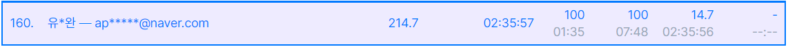

# Algorithm Study

## 목차

1. [개요](#1.-개요)
2. [대회](#2.-대회)
3. [알고리즘](#3.-알고리즘)

## 1. 개요

- 매일매일 알고리즘을 풀고 주석과 함께 풀이를 올리는 저장소입니다.
- 문제 사이트  |  아이디
  - Algospot  |  kaser
  - Backjoon  |  applyoo
  - Programmers  |  Yookaser
  - SWEA  |  유동완_0647265

- 개인 메일
  - applyoo@naver.com  |  yookaser@gmail.com

## 2. 대회

### 1) 2021프로그래머스 월간 코드 챌린지 시즌3 9월

> ##### 2021년 진행된 프로그래머스 월간 코드 챌린지 시즌3의 9월 미션입니다.
>
> 링크: https://programmers.co.kr/competitions/1581?slug=monthly-code-challenge-s3
>
> ##### 
>
> 참가자 5120명 중 공동 144위에 랭크했습니다.

### 2) 2021프로그래머스 월간 코드 챌린지 시즌3 10월

> ##### 2021년 진행된 프로그래머스 월간 코드 챌린지 시즌3의 10월 미션입니다.
>
> 링크: https://programmers.co.kr/competitions/1581
>
> ##### 
>
> 참가자 5698명 중 공동 160위에 랭크했습니다.

## 3. 자료구조 & 알고리즘

- **다익스트라**
  - 1753(`G5`) | 1916(`G5`)
- **플루이드**
  - 11404(`G4`)
- **벨만 포드**
  - 1865(`G3`)
- **LIS(가장 긴 증가하는 부분 수열)**
  - 11053(`S2`) | 14002(`G4`) | 12015(`G2`) | 12738(`G2`) | 14003(`P5`)
- **LCS(최장 공통 부분 수열)**
  - 9251(`G5`) | 9252(`G5`)
- **LCA**
- **MST**
- **냅색 알고리즘**
  - 1450(`G1`)
- **유니온 파인드**
  - 1717(`G4`) | 1976(`G4`)
- **슬라이딩 윈도우**
  - 11003(`P5`)
- **KMP**
  - 1786(`P5`) | 4354(`P5`)

- 시리즈 문제
  - 숨바꼭질(bfs, dp)
    - 1697(`S1`) | 12851(`G5`) | 13549(`G5`) | 13913(`G4`)
