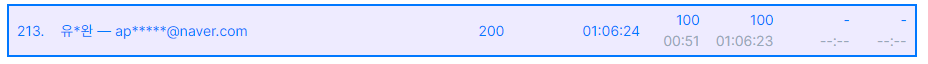

# Algorithm Study

[[_TOC_]]

## 1. 개요

- 매일매일 알고리즘을 풀고 주석과 함께 풀이를 올리는 저장소입니다.
- 문제 사이트  |  아이디
  - Algospot  |  kaser
  - Backjoon  |  applyoo
  - Programmers  |  Yookaser
  - SWEA  |  유동완_0647265

- 개인 메일
  - applyoo@naver.com  |  yookaser@gmail.com

## 2. 대회

### 1) 2021프로그래머스 월간 코드 챌린지 시즌3 9월

> ##### 2021년 진행된 프로그래머스 월간 코드 챌린지 시즌3의 9월 미션입니다.
>
> 링크: https://programmers.co.kr/competitions/1581?slug=monthly-code-challenge-s3
>
> ##### 
>
> 참가자 5120명 중 공동 144위에 랭크했습니다.

## 3. 알고리즘

- 미정